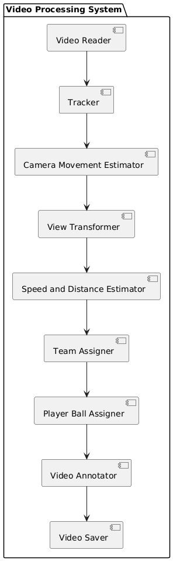

# Documentation

## Table of Contents
1. [Introduction and Goals](#1-introduction-and-goals)
2. Constraints
3. [Context and Scope](#3-context-and-scope)
4. [Solution Strategy](#4-solution-strategy)
5. [Building Block View](#5-building-block-view)
   - [Overall System Architecture](#51-overall-system-architecture)
   - [Detailed Component Descriptions](#52-detailed-component-descriptions)
     - [Video Reader](#521-video-reader)
     - Tracker
     - [Camera Movement Estimator](#523-camera-movement-estimator)
     - [View Transformer](#524-view-transformer)
     - [Speed and Distance Estimator](#525-speed-and-distance-estimator)
     - [Team Assigner](#526-team-assigner)
     - [Player Ball Assigner](#527-player-ball-assigner)
     - [Video Annotator](#528-video-annotator)
     - [Video Saver](#529-video-saver)
   - [Architecture Diagram](#53-architecture-diagram)
6. [Runtime View](#6-runtime-view)
7. [Deployment View](#7-deployment-view)
8. [Cross-cutting Concepts](#8-cross-cutting-concepts)
9. [Design Decisions](#9-design-decisions)
10. [Quality Requirements](#10-quality-requirements)
11. [Risks and Technical Debt](#11-risks-and-technical-debt)
12. Glossary

## 1. Introduction and Goals

This project applies established models and algorithms from the area of computer vision to collect information from recorded football games. The collected information is used to build more features which represent more information on the processed recording. The aim of this project is to produce an event log of the recording and an annotated video. The annotated video is used for evaluation and research purposes. The produced event log is the result which we want.

The event log shall include information on which players have the ball, for how long, ball possession per team, passes, goals, fouls. These events can be constructed from the information collected by using computer vision methods. 

This project processes a video file to track objects, estimate camera movement, transform views, interpolate ball positions, estimate speed and distance, assign player teams, and determine ball possession. The processed video is then saved with annotations. The goal is to provide a comprehensive analysis of sports videos using computer vision and AI models.

## 2. Constraints
- The project relies on pre-trained AI models for object tracking and other estimations.
- The input video file must be in a compatible format (e.g., MP4).
- The project uses specific stub files for reading precomputed data.

## 3. Context and Scope
This project is designed for analyzing sports videos, particularly for tracking players and the ball, estimating their movements, and annotating the video with this information. It is intended for use by sports analysts, coaches, and enthusiasts.

## 4. Solution Strategy
The solution involves reading a video file, processing it through various components to extract and analyze information, and then saving the annotated video. The processing includes object tracking, camera movement estimation, view transformation, speed and distance estimation, team assignment, and ball possession assignment.

### 4.1 Computer Vision

#### AI-driven project goals

The goal of this project is to detect and track players, referees, and footballs in a video using YOLO, one of the best AI object detection models available. We will also train the model to improve its performance. Additionally, we will assign players to teams based on the colors of their t-shirts using Kmeans for pixel segmentation and clustering. With this information, we can measure a team's ball acquisition percentage in a match. We will also use optical flow to measure camera movement between frames, enabling us to accurately measure a player's movement. Furthermore, we will implement perspective transformation to represent the scene's depth and perspective, allowing us to measure a player's movement in meters rather than pixels. Finally, we will calculate a player's speed and the distance covered. This project covers various concepts and addresses real-world problems, making it suitable for both beginners and experienced machine learning engineers.

#### AI Features

* YOLO: AI object detection model
* Kmeans: Pixel segmentation and clustering to detect t-shirt color
* Optical Flow: Measure camera movement
* Perspective Transformation: Represent scene depth and perspective
* Speed and distance calculation per player

## 5. Building Block View

### 5.1. Overall System Architecture
The system is composed of several components that work together to process and analyze the video. The main components are:
- **Video Reader**: Reads the input video file.
- **Tracker**: Tracks objects (players and ball) in the video.
- **Camera Movement Estimator**: Estimates and adjusts for camera movement.
- **View Transformer**: Transforms the view to a standard perspective.
- **Speed and Distance Estimator**: Estimates the speed and distance of tracked objects.
- **Team Assigner**: Assigns teams to players.
- **Player Ball Assigner**: Determines which player has possession of the ball.
- **Video Annotator**: Draws annotations on the video frames.
- **Video Saver**: Saves the annotated video to a file.

### 5.2. Detailed Component Descriptions

#### 5.2.1. Video Reader
- **Function**: `read_video`
- **Description**: Reads the input video file and returns the video frames.

#### 5.2.2. Tracker
- **Class**: `Tracker`
- **Model**: Pre-trained model (`models/best.pt`)
- **Functions**:
  - `get_object_tracks`: Retrieves object tracks from the video frames.
  - `add_position_to_tracks`: Adds positions to the tracks.
  - `interpolate_ball_positions`: Interpolates ball positions in the tracks.
  - `draw_annotations`: Draws object tracks on the video frames.

**Implementation Details**:
The `Tracker` class uses the YOLO model for object detection and the ByteTrack algorithm for tracking. It includes methods for detecting objects in video frames, interpolating missing ball positions, and drawing annotations on the video frames.

- **`__init__(self, model_path)`**: Initializes the tracker with a pre-trained YOLO model.
- **`add_position_to_tracks(self, tracks)`**: Adds positions to the tracks based on bounding box information.
- **`interpolate_ball_positions(self, ball_positions)`**: Interpolates missing ball positions using pandas DataFrame.
- **`detect_frames(self, frames)`**: Detects objects in video frames in batches.
- **`get_object_tracks(self, frames, read_from_stub=False, stub_path=None)`**: Retrieves object tracks from video frames or stub files.
- **`draw_ellipse(self, frame, bbox, color, track_id=None)`**: Draws an ellipse around the tracked object.
- **`draw_traingle(self, frame, bbox, color)`**: Draws a triangle to indicate ball possession.
- **`draw_team_ball_control(self, frame, frame_num, team_ball_control)`**: Draws a semi-transparent rectangle showing team ball control statistics.
- **`draw_annotations(self, video_frames, tracks, team_ball_control)`**: Draws all annotations on the video frames.

#### 5.2.3. Camera Movement Estimator
- **Class**: `CameraMovementEstimator`
- **Functions**:
  - `get_camera_movement`: Estimates camera movement for each frame.
  - `add_adjust_positions_to_tracks`: Adjusts track positions based on camera movement.
  - `draw_camera_movement`: Draws camera movement annotations on the video frames.

**Implementation Details**:
The `CameraMovementEstimator` class uses optical flow to estimate camera movement between frames. It includes methods for initializing feature points, estimating camera movement, and adjusting object positions based on the estimated movement.

- **`__init__(self, frame)`**: Initializes the camera movement estimator with the first frame of the video.
- **`add_adjust_positions_to_tracks(self, tracks, camera_movement_per_frame)`**: Adjusts track positions based on camera movement for each frame.
- **`get_camera_movement(self, frames, read_from_stub=False, stub_path=None)`**: Estimates camera movement for each frame using optical flow.
- **`draw_camera_movement(self, frames, camera_movement_per_frame)`**: Draws camera movement annotations on the video frames.

**Method Details**:
- **`__init__(self, frame)`**:
  - **Description**: Initializes the camera movement estimator with the first frame of the video.
  - **Parameters**:
    - `frame`: The first frame of the video.
  - **Implementation**:
    - Converts the first frame to grayscale.
    - Initializes feature points using the Shi-Tomasi corner detection method.
    - Sets parameters for the Lucas-Kanade optical flow algorithm.

- **`add_adjust_positions_to_tracks(self, tracks, camera_movement_per_frame)`**:
  - **Description**: Adjusts track positions based on camera movement for each frame.
  - **Parameters**:
    - `tracks`: A dictionary of object tracks.
    - `camera_movement_per_frame`: A list of camera movement vectors for each frame.
  - **Implementation**:
    - Iterates through each object and frame in the tracks.
    - Adjusts the position of each object based on the camera movement vector for the corresponding frame.

- **`get_camera_movement(self, frames, read_from_stub=False, stub_path=None)`**:
  - **Description**: Estimates camera movement for each frame using optical flow.
  - **Parameters**:
    - `frames`: A list of video frames.
    - `read_from_stub`: Boolean indicating whether to read from a stub file.
    - `stub_path`: Path to the stub file.
  - **Returns**: A list of camera movement vectors for each frame.
  - **Implementation**:
    - Converts the first frame to grayscale and initializes feature points.
    - Iterates through each subsequent frame, calculating optical flow to estimate camera movement.
    - Stores the camera movement vectors and optionally saves them to a stub file.

- **`draw_camera_movement(self, frames, camera_movement_per_frame)`**:
  - **Description**: Draws camera movement annotations on the video frames.
  - **Parameters**:
    - `frames`: A list of video frames.
    - `camera_movement_per_frame`: A list of camera movement vectors for each frame.
  - **Returns**: A list of video frames with camera movement annotations.
  - **Implementation**:
    - Iterates through each frame and overlays camera movement information as text annotations.

#### 5.2.4. View Transformer
- **Class**: `ViewTransformer`
- **Functions**:
  - `add_transformed_position_to_tracks`: Transforms and adds positions to the tracks.

**Implementation Details**:
The `ViewTransformer` class uses perspective transformation to map points from the video frame to a standard court view. It includes methods for transforming individual points and adding transformed positions to the tracks.

- **`__init__(self)`**: Initializes the view transformer with the court dimensions and perspective transformation matrix.
- **`transform_point(self, point)`**: Transforms a point from the video frame to the standard court view.
- **`add_transformed_position_to_tracks(self, tracks)`**: Transforms and adds positions to the tracks.

**Method Details**:
- **`__init__(self)`**:
  - **Description**: Initializes the view transformer with the court dimensions and perspective transformation matrix.
  - **Implementation**:
    - Defines the court dimensions and the pixel coordinates of the court vertices in the video frame.
    - Calculates the perspective transformation matrix using OpenCV's `getPerspectiveTransform` function.

- **`transform_point(self, point)`**:
  - **Description**: Transforms a point from the video frame to the standard court view.
  - **Parameters**:
    - `point`: A point in the video frame.
  - **Returns**: The transformed point in the standard court view, or `None` if the point is outside the court.
  - **Implementation**:
    - Checks if the point is inside the court using OpenCV's `pointPolygonTest` function.
    - Transforms the point using OpenCV's `perspectiveTransform` function.

- **`add_transformed_position_to_tracks(self, tracks)`**:
  - **Description**: Transforms and adds positions to the tracks.
  - **Parameters**:
    - `tracks`: A dictionary of object tracks.
  - **Implementation**:
    - Iterates through each object and frame in the tracks.
    - Transforms the adjusted position of each object to the standard court view.
    - Adds the transformed position to the track information.

#### 5.2.5. Speed and Distance Estimator
- **Class**: `SpeedAndDistance_Estimator`
- **Functions**:
  - `add_speed_and_distance_to_tracks`: Adds speed and distance information to the tracks.
  - `draw_speed_and_distance`: Draws speed and distance annotations on the video frames.

**Implementation Details**:
The `SpeedAndDistance_Estimator` class calculates the speed and distance covered by players over a series of frames. It includes methods for adding speed and distance information to the tracks and drawing this information on the video frames.

- **`__init__(self)`**: Initializes the speed and distance estimator with default parameters.
- **`add_speed_and_distance_to_tracks(self, tracks)`**: Adds speed and distance information to the tracks.
- **`draw_speed_and_distance(self, frames, tracks)`**: Draws speed and distance annotations on the video frames.

**Method Details**:
- **`__init__(self)`**:
  - **Description**: Initializes the speed and distance estimator with default parameters.
  - **Implementation**:
    - Sets the frame window and frame rate for calculating speed and distance.

- **`add_speed_and_distance_to_tracks(self, tracks)`**:
  - **Description**: Adds speed and distance information to the tracks.
  - **Parameters**:
    - `tracks`: A dictionary of object tracks.
  - **Implementation**:
    - Iterates through each object and frame in the tracks.
    - Calculates the distance covered and speed for each player over a series of frames.
    - Adds the speed and distance information to the track information.

- **`draw_speed_and_distance(self, frames, tracks)`**:
  - **Description**: Draws speed and distance annotations on the video frames.
  - **Parameters**:
    - `frames`: A list of video frames.
    - `tracks`: A dictionary of object tracks.
  - **Returns**: A list of video frames with speed and distance annotations.
  - **Implementation**:
    - Iterates through each frame and overlays speed and distance information as text annotations.

#### 5.2.6. Team Assigner
- **Class**: `TeamAssigner`
- **Functions**:
  - `assign_team_color`: Assigns team colors to players.
  - `get_player_team`: Determines the team of a player based on their position.

**Implementation Details**:
The `TeamAssigner` class uses KMeans clustering to assign team colors to players based on the colors of their uniforms. It includes methods for extracting player colors from video frames, clustering these colors, and assigning teams based on the clusters.

- **`__init__(self)`**: Initializes the team assigner with empty dictionaries for team colors and player-team mappings.
- **`get_clustering_model(self, image)`**: Reshapes the image to a 2D array and performs KMeans clustering with 2 clusters.
- **`get_player_color(self, frame, bbox)`**: Extracts the top half of the player's bounding box from the frame, performs KMeans clustering, and determines the player's color.
- **`assign_team_color(self, frame, player_detections)`**: Extracts colors for all detected players, performs KMeans clustering to assign team colors, and stores the team colors.
- **`get_player_team(self, frame, player_bbox, player_id)`**: Determines the team of a player based on their color and assigns the team to the player.

#### 5.2.7. Player Ball Assigner
- **Class**: `PlayerBallAssigner`
- **Functions**:
  - `assign_ball_to_player`: Determines which player has possession of the ball.

**Implementation Details**:
The `PlayerBallAssigner` class uses distance measurements to determine which player is closest to the ball and assigns ball possession accordingly. It includes methods for calculating distances between players and the ball and assigning ball possession based on these distances.

- **`__init__(self)`**: Initializes the player ball assigner with a maximum distance threshold for ball possession.
- **`assign_ball_to_player(self, players, ball_bbox)`**: Determines which player has possession of the ball based on the distance between the player and the ball.

**Method Details**:
- **`assign_ball_to_player(self, players, ball_bbox)`**:
  - **Description**: Determines which player has possession of the ball based on the distance between the player and the ball.
  - **Parameters**:
    - `players`: A dictionary of player detections with bounding boxes.
    - `ball_bbox`: The bounding box of the ball.
  - **Returns**: The ID of the player closest to the ball, or -1 if no player is within the maximum distance threshold.
  - **Implementation**:
    - Extracts the center position of the ball from its bounding box.
    - Iterates through each player and calculates the distance from the player's bounding box to the ball's center position.
    - Assigns the ball to the player with the minimum distance, provided the distance is below the maximum threshold.

#### 5.2.8. Video Annotator
- **Functions**:
  - `draw_annotations`: Draws object tracks on the video frames.
  - `draw_camera_movement`: Draws camera movement annotations on the video frames.
  - `draw_speed_and_distance`: Draws speed and distance annotations on the video frames.

#### 5.2.9. Video Saver
- **Function**: `save_video`
- **Description**: Saves the annotated video to a file.

### 5.3. Architecture Diagram

Right now the architecture is just a pipeline as seen in the following diagram:

## 6. Runtime View
The main function orchestrates the processing pipeline, calling each component in sequence to process the video and generate the annotated output.

## 7. Deployment View
The project is intended to be run as a standalone script on a machine with the necessary dependencies installed. The output is an annotated video file saved to disk.

## 8. Cross-cutting Concepts
- **AI Models**: Pre-trained models are used for object tracking and other estimations.
- **Stub Files**: Used for reading precomputed data to speed up processing.
- **Annotations**: Visual annotations are added to the video frames to highlight tracked objects, camera movement, speed, and distance.

## 9. Design Decisions
- Use of pre-trained models for object tracking to leverage existing AI capabilities.
- Use of stub files to allow for faster processing during development and testing.
- Modular design to separate different aspects of video processing and analysis.

## 10. Quality Requirements
- **Performance**: Efficient processing of video frames to handle large video files.
- **Accuracy**: Accurate tracking and estimation of object positions, camera movement, speed, and distance.
- **Usability**: Clear and informative annotations on the video frames.

## 11. Risks and Technical Debt
- Dependency on pre-trained models which may need updates or retraining for different scenarios.
- Potential performance bottlenecks with large video files or high-resolution frames.

## 12. Glossary

### Technical Expressions

| Term                          | Definition                                                                                   |
|-------------------------------|----------------------------------------------------------------------------------------------|
| **AI Model**                  | A pre-trained artificial intelligence model used for tasks such as object tracking and estimation. |
| **Annotation**                | Visual markers added to the video frames to highlight important information.                 |
| **Bounding Box (bbox)**       | A rectangular box that encloses an object in an image or video frame.                        |
| **ByteTrack**                 | An algorithm used for tracking objects across video frames.                                  |
| **Camera Movement Estimator** | A component that estimates and adjusts for camera movement in video frames.                  |
| **Clustering**                | A machine learning technique used to group similar data points together.                     |
| **Distance Measurement**      | The calculation of the distance between two points.                                          |
| **Feature Points**            | Specific points in an image used for tracking and estimation.                                |
| **Frame Rate**                | The number of frames displayed per second in a video.                                        |
| **Interpolation**             | A method of estimating unknown values that fall between known values.                        |
| **KMeans Clustering**         | A clustering algorithm used to partition data into K clusters.                               |
| **Optical Flow**              | A method used to estimate the motion of objects between consecutive frames.                  |
| **Perspective Transformation**| A mathematical operation that maps points from one plane to another.                        |
| **Pre-trained Model**         | An AI model that has been previously trained on a large dataset.                             |
| **Shi-Tomasi Corner Detection**| An algorithm used to detect corners in an image.                                            |
| **Stub File**                 | A file containing precomputed data used to speed up processing.                              |
| **YOLO (You Only Look Once)** | A real-time object detection system.                                                         |

### Domain-Oriented Expressions

| Term                      | Definition                                                                                   |
|---------------------------|----------------------------------------------------------------------------------------------|
| **Ball Possession**       | The determination of which player has control of the ball.                                    |
| **Court Dimensions**      | The width and length of the sports court.                                                     |
| **Distance Covered**      | The total distance traveled by a player.                                                      |
| **Player Detection**      | The identification and localization of players in video frames.                               |
| **Player Team Assignment**| The process of assigning players to their respective teams based on their uniform colors.     |
| **Speed Estimation**      | The calculation of a player's speed based on their movement across frames.                    |
| **Team Color**            | The color associated with a player's team.                                                    |
| **Track**                 | The path or trajectory of an object (player or ball) in the video.                            |
| **Transformed Position**  | The position of an object after applying perspective transformation.                          |
| **Video Annotation**      | The process of adding visual markers to video frames to highlight important information.      |